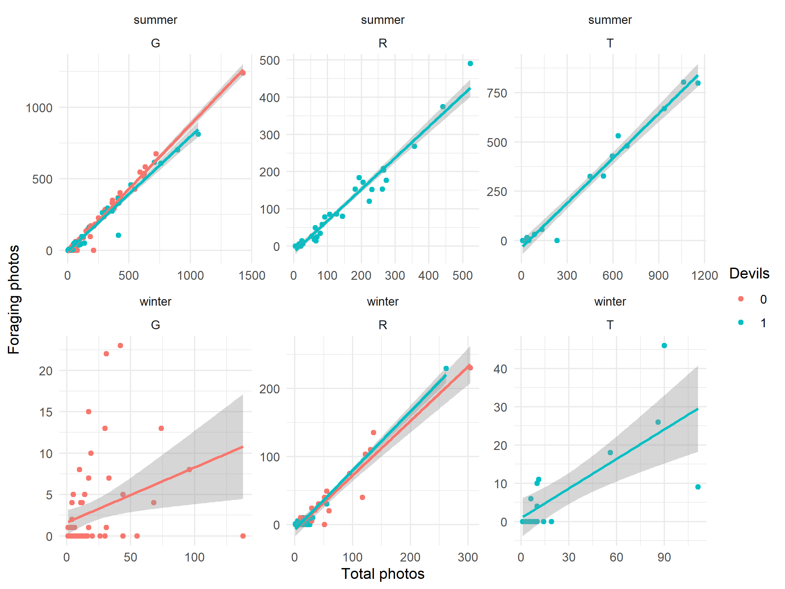
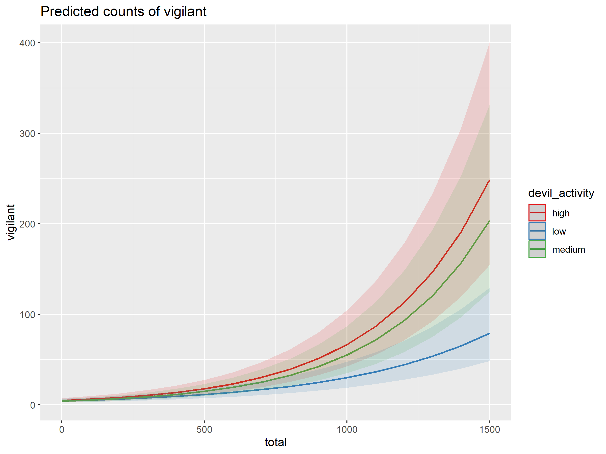

Quoll Foraging
================
Riley M. Anderson
May 16, 2025

  

- [Overview](#overview)
  - [Summary of Results](#summary-of-results)
- [Scavenger abundance](#scavenger-abundance)
- [Vigilance](#vigilance)
  - [Vigilance by devil presence or absence, site, and
    season](#vigilance-by-devil-presence-or-absence-site-and-season)
  - [Vigilance by devil presence or
    absence.](#vigilance-by-devil-presence-or-absence)
  - [Vigilance by carcass treatment, site, and season (E = excluded, S =
    access).](#vigilance-by-carcass-treatment-site-and-season-e--excluded-s--access)
  - [Vigilance by carcass treatment (E = excluded, S =
    access).](#vigilance-by-carcass-treatment-e--excluded-s--access)
- [Foraging](#foraging)
  - [Foraging by devil presence or absence, site, and
    season](#foraging-by-devil-presence-or-absence-site-and-season)
  - [Foraging by devil presence or
    absence.](#foraging-by-devil-presence-or-absence)
  - [Foraging by carcass treatment, site, and season (E = excluded, S =
    access).](#foraging-by-carcass-treatment-site-and-season-e--excluded-s--access)
  - [Foraging by carcass treatment (E = excluded, S =
    access).](#foraging-by-carcass-treatment-e--excluded-s--access)
- [Devil activity as a predictor](#devil-activity-as-a-predictor)
  - [Foraging efficiency](#foraging-efficiency)
  - [Vigilance](#vigilance-1)
  - [Foraging initiation](#foraging-initiation)

## Overview

What is this analysis about?

### Summary of Results

- 

## Scavenger abundance

| species              | season |   n |
|:---------------------|:-------|----:|
| Spotted-tailed quoll | summer | 151 |
| Spotted-tailed quoll | winter | 165 |
| Tasmanian devil      | summer | 323 |
| Tasmanian devil      | winter | 170 |

## Vigilance

### Vigilance by devil presence or absence, site, and season

<!-- -->

    ## Overdispersion ratio for model: vig_mod1 
    ## formula: cbind(vigilant, total) ~ season * devil_poa + carcass_present 
    ## 
    ## Acceptable range: 1 - 1.4
    ## Overdispersion ratio: 5.946  df: 304  p = 0 
    ##  Data are overdispersed
    ##    ratio deviance       df   pvalue 
    ##    5.946 1807.565  304.000    0.000
    ## 
    ## Call:
    ## glm(formula = cbind(vigilant, total) ~ season * devil_poa + carcass_present, 
    ##     family = quasibinomial(), data = filter(detections, species == 
    ##         "Spotted-tailed quoll" & devil_poa != "NA"))
    ## 
    ## Deviance Residuals: 
    ##     Min       1Q   Median       3Q      Max  
    ## -7.6988  -1.6610  -0.8837   0.7752  10.4621  
    ## 
    ## Coefficients:
    ##                         Estimate Std. Error t value Pr(>|t|)    
    ## (Intercept)              -3.3547     0.2108 -15.916  < 2e-16 ***
    ## seasonwinter              0.6542     0.1882   3.476 0.000583 ***
    ## devil_poa1                0.5983     0.1155   5.182 4.01e-07 ***
    ## carcass_present1          0.4230     0.1926   2.197 0.028807 *  
    ## seasonwinter:devil_poa1  -0.2169     0.2739  -0.792 0.429160    
    ## ---
    ## Signif. codes:  0 '***' 0.001 '**' 0.01 '*' 0.05 '.' 0.1 ' ' 1
    ## 
    ## (Dispersion parameter for quasibinomial family taken to be 5.945941)
    ## 
    ##     Null deviance: 1984.6  on 308  degrees of freedom
    ## Residual deviance: 1729.7  on 304  degrees of freedom
    ## AIC: NA
    ## 
    ## Number of Fisher Scoring iterations: 5

<!-- --><!-- -->

### Vigilance by devil presence or absence.

<!-- -->

    ## 
    ## Call:
    ## glm(formula = cbind(vigilant, total) ~ devil_poa, family = quasibinomial(), 
    ##     data = filter(detections, species == "Spotted-tailed quoll" & 
    ##         devil_poa != "NA"))
    ## 
    ## Deviance Residuals: 
    ##     Min       1Q   Median       3Q      Max  
    ## -8.2918  -1.4812  -0.7671   0.9564  10.4995  
    ## 
    ## Coefficients:
    ##             Estimate Std. Error t value Pr(>|t|)    
    ## (Intercept) -2.80319    0.08777 -31.938  < 2e-16 ***
    ## devil_poa1   0.46503    0.10583   4.394 1.53e-05 ***
    ## ---
    ## Signif. codes:  0 '***' 0.001 '**' 0.01 '*' 0.05 '.' 0.1 ' ' 1
    ## 
    ## (Dispersion parameter for quasibinomial family taken to be 6.515287)
    ## 
    ##     Null deviance: 1984.6  on 308  degrees of freedom
    ## Residual deviance: 1852.8  on 307  degrees of freedom
    ## AIC: NA
    ## 
    ## Number of Fisher Scoring iterations: 5

<!-- -->

### Vigilance by carcass treatment, site, and season (E = excluded, S = access).

<!-- -->

### Vigilance by carcass treatment (E = excluded, S = access).

<!-- -->

## Foraging

### Foraging by devil presence or absence, site, and season

<!-- -->

### Foraging by devil presence or absence.

<!-- -->

### Foraging by carcass treatment, site, and season (E = excluded, S = access).

<!-- -->

### Foraging by carcass treatment (E = excluded, S = access).

<!-- -->

## Devil activity as a predictor

### Foraging efficiency

<!-- -->

    ## [1] "high"   "low"    "medium"
    ## 
    ## Call:
    ## glm(formula = cbind(foraging_carc, total) ~ devil_activity, family = binomial(), 
    ##     data = filter(detections, species == "Spotted-tailed quoll", 
    ##         !is.na(devil_activity)))
    ## 
    ## Deviance Residuals: 
    ##      Min        1Q    Median        3Q       Max  
    ## -15.5047   -3.0407   -1.8020    0.4485    5.2781  
    ## 
    ## Coefficients:
    ##                      Estimate Std. Error z value Pr(>|z|)    
    ## (Intercept)          -0.39838    0.01516 -26.281  < 2e-16 ***
    ## devil_activitylow     0.11426    0.02013   5.676 1.38e-08 ***
    ## devil_activitymedium  0.08106    0.02073   3.910 9.23e-05 ***
    ## ---
    ## Signif. codes:  0 '***' 0.001 '**' 0.01 '*' 0.05 '.' 0.1 ' ' 1
    ## 
    ## (Dispersion parameter for binomial family taken to be 1)
    ## 
    ##     Null deviance: 3293.6  on 308  degrees of freedom
    ## Residual deviance: 3260.4  on 306  degrees of freedom
    ## AIC: 4214.2
    ## 
    ## Number of Fisher Scoring iterations: 4

<!-- -->

### Vigilance

<!-- -->

    ## 
    ## Call:
    ## glm(formula = cbind(vigilant, total) ~ devil_activity, family = quasibinomial(), 
    ##     data = filter(detections, species == "Spotted-tailed quoll", 
    ##         !is.na(devil_activity)))
    ## 
    ## Deviance Residuals: 
    ##     Min       1Q   Median       3Q      Max  
    ## -8.3849  -1.4210  -0.7326   0.8807  11.7851  
    ## 
    ## Coefficients:
    ##                      Estimate Std. Error t value Pr(>|t|)    
    ## (Intercept)          -2.24206    0.07978 -28.101  < 2e-16 ***
    ## devil_activitylow    -0.54160    0.12224  -4.431 1.31e-05 ***
    ## devil_activitymedium -0.26328    0.11730  -2.245   0.0255 *  
    ## ---
    ## Signif. codes:  0 '***' 0.001 '**' 0.01 '*' 0.05 '.' 0.1 ' ' 1
    ## 
    ## (Dispersion parameter for quasibinomial family taken to be 6.623148)
    ## 
    ##     Null deviance: 1984.6  on 308  degrees of freedom
    ## Residual deviance: 1852.4  on 306  degrees of freedom
    ## AIC: NA
    ## 
    ## Number of Fisher Scoring iterations: 5
    ## Overdispersion ratio for model: vig_mod4 
    ## formula: cbind(vigilant, total) ~ devil_activity 
    ## 
    ## Acceptable range: 1 - 1.4
    ## Overdispersion ratio: 6.623  df: 306  p = 0 
    ##  Data are overdispersed
    ##    ratio deviance       df   pvalue 
    ##    6.623 2026.683  306.000    0.000

<!-- --><!-- --><!-- -->

    ##  Family: poisson  ( log )
    ## Formula:          vigilant ~ total * devil_activity + (1 | replicate)
    ## Data: 
    ## filter(detections, species == "Spotted-tailed quoll", !is.na(devil_activity))
    ## 
    ##      AIC      BIC   logLik deviance df.resid 
    ##   3751.1   3777.2  -1868.5   3737.1      302 
    ## 
    ## Random effects:
    ## 
    ## Conditional model:
    ##  Groups    Name        Variance Std.Dev.
    ##  replicate (Intercept) 0.2895   0.5381  
    ## Number of obs: 309, groups:  replicate, 6
    ## 
    ## Conditional model:
    ##                              Estimate Std. Error z value Pr(>|z|)    
    ## (Intercept)                 1.560e+00  2.266e-01   6.886 5.75e-12 ***
    ## total                       2.638e-03  8.637e-05  30.539  < 2e-16 ***
    ## devil_activitylow          -9.472e-02  7.221e-02  -1.312   0.1896    
    ## devil_activitymedium       -1.677e-01  7.724e-02  -2.172   0.0299 *  
    ## total:devil_activitylow    -7.011e-04  1.303e-04  -5.379 7.49e-08 ***
    ## total:devil_activitymedium -2.196e-05  1.132e-04  -0.194   0.8462    
    ## ---
    ## Signif. codes:  0 '***' 0.001 '**' 0.01 '*' 0.05 '.' 0.1 ' ' 1

<!-- -->

### Foraging initiation

<!-- --> \##
Session Information

    R version 4.2.3 (2023-03-15 ucrt)
    Platform: x86_64-w64-mingw32/x64 (64-bit)
    Running under: Windows 10 x64 (build 19045)

    Matrix products: default

    locale:
    [1] LC_COLLATE=English_United States.utf8 
    [2] LC_CTYPE=English_United States.utf8   
    [3] LC_MONETARY=English_United States.utf8
    [4] LC_NUMERIC=C                          
    [5] LC_TIME=English_United States.utf8    

    attached base packages:
    [1] stats     graphics  grDevices utils     datasets  methods   base     

    other attached packages:
     [1] knitr_1.47      sjPlot_2.8.16   emmeans_1.10.2  glmmTMB_1.1.9  
     [5] ggridges_0.5.6  cowplot_1.1.3   lubridate_1.9.3 forcats_1.0.0  
     [9] stringr_1.5.1   dplyr_1.1.4     purrr_1.0.2     readr_2.1.5    
    [13] tidyr_1.3.1     tibble_3.2.1    ggplot2_3.5.1   tidyverse_2.0.0

    loaded via a namespace (and not attached):
     [1] splines_4.2.3       datawizard_0.11.0   highr_0.11         
     [4] yaml_2.3.8          bayestestR_0.13.2   numDeriv_2016.8-1.1
     [7] pillar_1.9.0        lattice_0.20-45     glue_1.7.0         
    [10] digest_0.6.35       RColorBrewer_1.1-3  minqa_1.2.7        
    [13] colorspace_2.1-0    sandwich_3.1-0      htmltools_0.5.8.1  
    [16] Matrix_1.5-3        pkgconfig_2.0.3     haven_2.5.4        
    [19] xtable_1.8-4        mvtnorm_1.2-5       scales_1.3.0       
    [22] tzdb_0.4.0          lme4_1.1-35.3       timechange_0.3.0   
    [25] mgcv_1.8-42         generics_0.1.3      farver_2.1.2       
    [28] sjlabelled_1.2.0    TH.data_1.1-2       withr_3.0.0        
    [31] TMB_1.9.11          cli_3.6.2           effectsize_0.8.8   
    [34] survival_3.5-3      magrittr_2.0.3      estimability_1.5.1 
    [37] evaluate_0.24.0     fansi_1.0.6         nlme_3.1-162       
    [40] MASS_7.3-58.2       tools_4.2.3         hms_1.1.3          
    [43] lifecycle_1.0.4     multcomp_1.4-25     munsell_0.5.1      
    [46] ggeffects_1.6.0     compiler_4.2.3      rlang_1.1.4        
    [49] grid_4.2.3          nloptr_2.0.3        parameters_0.21.7  
    [52] rstudioapi_0.16.0   labeling_0.4.3      rmarkdown_2.27     
    [55] boot_1.3-28.1       gtable_0.3.5        codetools_0.2-19   
    [58] sjstats_0.19.0      sjmisc_2.8.10       R6_2.5.1           
    [61] zoo_1.8-12          performance_0.12.0  fastmap_1.2.0      
    [64] utf8_1.2.4          rprojroot_2.0.4     insight_1.0.1      
    [67] stringi_1.8.4       Rcpp_1.0.12         vctrs_0.6.5        
    [70] tidyselect_1.2.1    xfun_0.44           coda_0.19-4.1      
